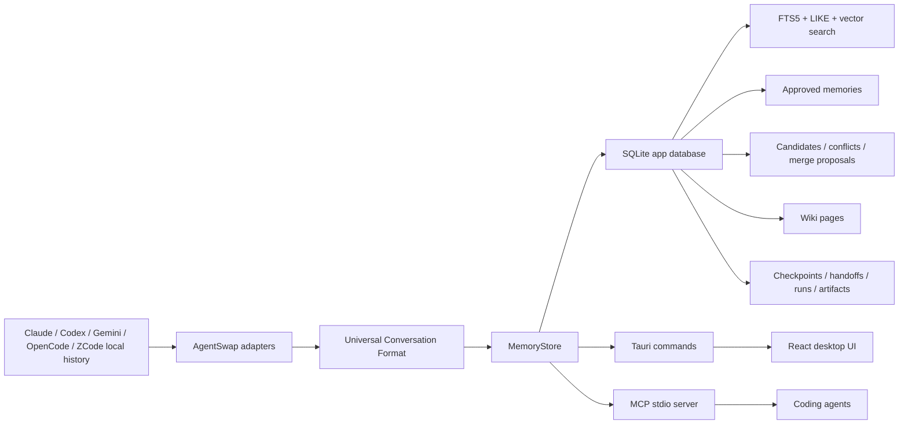

# ChatMem 架构与功能说明

本文档基于当前仓库源码整理，代码根目录为 `D:\VSP\chatmem`，应用版本为 `1.1.0`。ChatMem 的核心定位是“本地优先的 AI 编程记忆与迁移层”：它把 Claude、Codex、Gemini、OpenCode、ZCode 等本地对话历史统一解析、索引、治理，并通过桌面端和 MCP 两套入口提供给人和 agent 使用。

## 1. 总体定位

ChatMem 不是另一个聊天客户端，也不是单纯的向量数据库。它更像一个本地项目记忆控制台：

- 本地历史是证据层，回答“以前具体聊过什么、做过什么”。
- 启动规则是治理后的稳定记忆，回答“新任务开始时必须带上什么规则”。
- Wiki 是从已批准记忆和历史事件生成的可读投影，回答“这个项目现在是什么结构”。
- checkpoint 和 handoff 是继续工作层，回答“中断后从哪里接着做、交给哪个 agent”。
- MCP 是 agent 使用 ChatMem 的主要接口；桌面端是人类查看、审批、恢复、安装和同步的控制面。



## 2. 运行形态

ChatMem 当前有三种主要运行入口：

- 桌面应用：`src-tauri/src/main.rs` 启动 Tauri，前端在 `src/App.tsx` 和 `src/components/*` 中实现。
- MCP 服务：`ChatMem.exe --mcp` 或 `src-tauri/src/bin/chatmem-mcp.rs` 启动 stdio MCP server。
- 开发期 MCP launcher：`.mcp.json` 调用 `mcp/run-chatmem-mcp.ps1`，脚本会寻找 release/debug 的 `chatmem-mcp.exe`，也支持 `CHATMEM_REPO_ROOT` 和 `CHATMEM_MCP_BIN` 覆盖。

桌面端和 MCP 端都复用同一个 Rust 后端库 `chatmem::chatmem_memory`，核心状态都落在同一个本地 SQLite 数据库里。桌面端通过 Tauri command 调用，agent 通过 MCP tool 调用。

## 3. 技术栈与目录

主要技术栈：

- 前端：React 18、TypeScript、Vite。
- 桌面壳：Tauri 1。
- 后端：Rust。
- 数据库：SQLite，使用 `rusqlite` bundled SQLite。
- 检索：SQLite FTS5、LIKE 关键词匹配、本地 hash embedding，支持 OpenAI-compatible embedding provider。
- MCP：`rmcp` server + stdio transport。
- 凭据：WebDAV 密码存入系统 credential store，使用 `keyring`。

关键目录：

- `src/`：React 前端。`App.tsx` 是主工作台，`chatmem-memory/api.ts` 是 Tauri API 封装。
- `src/components/`：功能面板，如 `ProjectIndexStatus`、`MemoryInboxPanel`、`RepoMemoryPanel`、`SettingsPanel`、`CheckpointsPanel`、`HandoffsPanel`。
- `src-tauri/src/main.rs`：桌面端 Tauri command、对话浏览、迁移、回收站、WebDAV、MCP `--mcp` 分支。
- `src-tauri/src/chatmem_memory/`：ChatMem 记忆系统核心。
- `src-tauri/src/chatmem_memory/store.rs`：核心业务入口 `MemoryStore`。
- `src-tauri/src/chatmem_memory/mcp.rs`：MCP 工具注册与实现。
- `crates/agentswap-*`：Claude、Codex、Gemini、OpenCode、ZCode 等本地历史 adapter。
- `skills/chatmem/`：给 agent 使用的 ChatMem 操作指南。
- `mcp/run-chatmem-mcp.ps1`：开发期 MCP 启动脚本。

## 4. 核心后端模块

`chatmem_memory` 模块是系统中心：

- `db.rs`：打开应用数据库并迁移表结构。
- `store.rs`：记忆、索引、候选、审批、Wiki、handoff、检索的主业务层。
- `sync.rs`：扫描本地 agent 历史，导入对话，处理 repo path alias。
- `mcp.rs`：把 `MemoryStore` 能力暴露为 MCP tools。
- `models.rs`：Tauri/MCP 共享响应模型和输入模型。
- `chunks.rs`：把消息和文件变更拆成可检索 conversation chunks。
- `embedding.rs`：本地 hash embedding 与 OpenAI-compatible embedding。
- `search.rs`：紧凑启动记忆 payload、检索结果裁剪。
- `handoff.rs`：handoff packet 的默认构造逻辑。
- `runs.rs`：从对话证据派生 run 和 artifact。
- `repo_identity.rs`：repo root 规范化、canonical root、fingerprint。
- `a2a.rs`：轻量 AgentCard 描述能力面。

## 5. 数据库模型

ChatMem 的 SQLite schema 以 repo 为边界，主要表包括：

- `repos`：规范化后的仓库根、fingerprint。
- `repo_aliases`：旧 cwd、文件 cwd、Gemini hash、手工合并路径等别名。
- `conversation_repo_links`、`repo_scan_runs`：扫描审计和路径匹配诊断。
- `conversations`、`messages`、`tool_calls`、`file_changes`：本地对话证据层。
- `conversation_chunks`：按消息和文件变更生成的低 token 检索片段。
- `episodes`：从对话派生的工作事件摘要。
- `memory_candidates`：待审批启动规则候选。
- `approved_memories`：已批准启动规则，带 freshness 状态。
- `memory_conflicts`、`memory_merge_proposals`：冲突检测和合并改写建议。
- `wiki_pages`：从 approved memories 和 episodes 生成的 Wiki 投影。
- `search_documents`、`search_documents_fts`、`document_embeddings`：统一检索文档、FTS5、向量索引。
- `memory_entities`、`memory_entity_links`：轻量实体图。
- `checkpoints`、`handoff_packets`：继续工作状态。
- `agent_runs`、`run_events`、`artifacts`：从对话证据派生的运行与产物视图。
- `evidence_refs`：候选、记忆、episode 等对象的可追溯证据引用。

一个重要设计是：`search_documents` 是统一检索入口。conversation、chunk、episode、memory、wiki 都会写入这里，再同步写入 FTS、embedding、entity links。

## 6. 本地历史导入链路

ChatMem 通过 `AgentAdapter` trait 把不同 agent 的原生历史转成统一格式：

- `ClaudeAdapter`
- `CodexAdapter`
- `GeminiAdapter`
- `OpenCodeAdapter`

统一格式称为 Universal Conversation Format，核心字段包括 `Conversation`、`Message`、`ToolCall`、`FileChange`。每个 adapter 都实现：

- `is_available`
- `list_conversations`
- `read_conversation`
- `write_conversation`
- `delete_conversation`
- `render_prompt`
- `data_dir`

导入流程：

1. `import_all_local_history` 扫描所有可用 agent。
2. `scan_repo_conversations(repo_root)` 只针对当前 repo 做路径匹配。
3. `sync_conversation_into_store` 调用 `MemoryStore::upsert_conversation_snapshot`。
4. 对话写入 `conversations/messages/tool_calls/file_changes`。
5. 消息和文件变更拆成 `conversation_chunks`。
6. conversation、chunk、episode 写入 `search_documents`、FTS、embedding、entity links。
7. 显式 durable marker 会生成 `memory_candidates`，例如 `Remember:`、`Rule:`、`Gotcha:`、`记住：`、`规则：`、`注意：`。

路径匹配是 ChatMem 很重要的一层。`repo_identity.rs` 会规范化路径，`repo_aliases` 可以把旧目录、文件 cwd、生成路径合并到当前 canonical repo。扫描报告会保留未匹配 project root，桌面端可一键 merge alias。

## 7. 检索架构

`search_repo_history` 是混合检索：

- FTS5：查 `search_documents_fts`。
- LIKE/关键词：补充中文、路径、短 token 场景。
- 向量：本地 `chatmem-local-hash-v1` 默认可用。
- Provider embedding：如果设置 `CHATMEM_EMBEDDING_PROVIDER=openai-compatible`、base URL、model、dimensions、API key，则额外建立 provider embedding。

搜索时会：

- 确保本地 hash embedding 可用。
- provider 可用时优先用 provider embedding，同时保留本地 fallback。
- 查询当前 repo，并在必要时合并 ancestor/descendant repo 命中。
- 返回带 `source_agent`、`conversation_id`、`conversation_title`、`evidence_refs` 的证据，而不是原始大段 transcript。

`read_history_conversation` 用于在已有 `conversation_id` 后读取低 token 的消息窗口，可按 `message_id` 或 query 聚焦，默认窗口限制较小，避免把完整历史塞给 agent。

## 8. 记忆治理

ChatMem 把“历史”与“启动规则”严格分开：

- 历史对话导入后立即可检索，不需要审批。
- 候选记忆必须经过人或 agent 辅助审批，才会变成启动规则。
- 已批准记忆才会进入 `get_repo_memory` 和 agent startup context。

候选来源：

- agent 主动调用 `create_memory_candidate`。
- 自动抽取器从显式 marker 生成候选。
- 当前 agent 可调用 `propose_memory_merge` 提交合并改写方案，但不直接审批。

审批动作：

- `approve`：候选变成新的 `approved_memories`。
- `approve_with_edit`：审批前改写 title/value/usage hint。
- `approve_merge`：把候选合并进已有 memory。
- `reject`：拒绝候选。
- `snooze`：暂缓。

治理机制：

- `record_candidate_conflicts_tx` 会检测与同 kind 已批准规则之间的可能否定冲突。
- `suggest_memory_merges` 会为相似候选生成合并建议。
- `reverify_memory` 把规则重新标记为 fresh。
- `retire_memory` 让规则退出启动注入，但不删除审计记录。
- freshness 会随时间衰减，非 fresh 规则不会进入紧凑启动 payload。

## 9. Wiki 投影

Wiki 不是事实源，而是由 `rebuild_repo_wiki` 从 approved memories 和 episodes 生成的可读投影。当前生成页包括：

- `project-overview`：项目地图。
- `module-map`：从记忆和历史中提取路径、目录、模块线索。
- `risk-ledger`：从 gotcha、风险和失败历史生成风险台账。
- `commands`：命令类启动规则。
- `gotchas`：注意事项。
- `decisions-and-conventions`：决策、约定、策略、偏好。
- `recent-work`：最近工作。

每个 Wiki page 都保存 `source_memory_ids`、`source_episode_ids`、构建时间和状态，并写入 `search_documents`，因此 `search_repo_history` 可以搜到 wiki projection。但要修改事实源，仍应修改 approved memory 或重新导入/扫描历史，然后 rebuild。

## 10. MCP 工具面

`src-tauri/src/chatmem_memory/mcp.rs` 当前注册的 MCP tools：

- `get_project_context`：低 token 首选入口，返回 approved memories、recent handoff、diagnostics、少量历史证据和 pending candidates。
- `get_repo_memory`：返回紧凑 approved startup rules。
- `get_repo_memory_health`：返回本地历史、候选、索引、alias、latest scan 诊断。
- `import_all_local_history`：全量导入 Claude/Codex/Gemini/OpenCode 本地历史。
- `scan_repo_conversations`：扫描当前 repo 并返回路径匹配诊断。
- `merge_repo_alias`：修复 repo path drift。
- `search_repo_history`：混合检索本地历史、启动规则、Wiki。
- `read_history_conversation`：读取命中对话的聚焦窗口。
- `create_memory_candidate`：创建待审批启动规则候选。
- `propose_memory_merge`：创建 agent-authored merge proposal。
- `list_memory_candidates`：列出候选。
- `list_memory_conflicts`：列出候选冲突。
- `list_entity_graph`：列出轻量实体图。
- `create_checkpoint`：冻结当前上下文。
- `build_handoff_packet`：构建跨 agent 交接包。
- `resume_from_checkpoint`：把 checkpoint 提升为 handoff。
- `list_active_runs`：列出未完成/待关注 runs。
- `list_run_artifacts`：列出 run 派生产物。
- `list_repo_wiki_pages`：列出生成 Wiki。
- `rebuild_repo_wiki`：重建 Wiki。
- `rebuild_repo_embeddings`：按当前 provider 重建 embedding，同时保留本地 fallback。

MCP 工具在读取 repo 记忆或历史前，通常会先尝试 `sync_repo_conversations`，让索引尽量追上本地最新对话。

## 11. 桌面端功能

React 前端通过 `src/chatmem-memory/api.ts` 调 Tauri commands。主要用户功能包括：

- 对话浏览：列出和搜索 Claude/Codex/Gemini/OpenCode 本地对话。
- 对话详情：查看消息、工具调用、文件变更、存储路径和恢复命令。
- 跨 agent 迁移：`migrate_conversation` 支持 copy/cut，并在删除源之前验证目标可读、可列出、消息和文件变更数量。
- 回收站：删除会先写可恢复快照，再删除原始对话；支持过期清理和 restore。
- 本地历史状态：`ProjectIndexStatus` 展示对话数、chunk 数、候选数、启动规则数、latest scan、unmatched path，并可触发 rescan/alias merge。
- 历史回忆：项目页可通过 `get_project_context(intent="recall")` 直接检索本地历史证据。
- 启动规则抽屉：`MemoryInboxPanel`、`RepoMemoryPanel`、Wiki、Continuation 四类 tab 管理候选、已批准规则、Wiki、checkpoint/handoff。
- checkpoint/handoff：可冻结当前上下文、创建交接包、把 checkpoint 提升为 handoff、标记 consumed。
- runs/artifacts：从对话证据派生运行和产物摘要，当前更偏内部审计视图。
- 设置：语言、字体、窗口、更新、WebDAV、Agent integration。
- 关于页：解释 ChatMem 的产品定位和设计参考。

## 12. Agent integration

`src-tauri/src/agent_integration.rs` 负责把 ChatMem 安装进不同 agent 的用户级配置：

- Claude：写 `mcpServers.chatmem`，安装 skill，并写全局 `CLAUDE.md` 管理块。
- Codex：写 `config.toml` 的 `mcp_servers.chatmem`，安装 skill，并写 `AGENTS.md` 管理块。
- Gemini：写 `mcpServers.chatmem`，并写 `GEMINI.md` 引导规则。
- OpenCode：写 `opencode.json` 的 `mcp.chatmem`，安装 skill，并写 `AGENTS.md`。

安装前会备份现有配置为 `.bak-YYYYMMDD-HHMMSS`，卸载时只移除 ChatMem 自己管理的配置和 instruction block，不应破坏其他 MCP server。

安装版优先让 agent 启动：

```powershell
ChatMem.exe --mcp
```

开发版可以使用：

```powershell
powershell -NoProfile -ExecutionPolicy Bypass -File .\mcp\run-chatmem-mcp.ps1
```

## 13. WebDAV 与本地优先同步

WebDAV 是可选备份能力，不是日常检索的前提。桌面端设置页负责：

- 验证 WebDAV server，使用 `PROPFIND`。
- 保存 WebDAV 密码到 OS credential store。
- 手动 `sync_webdav_now`。
- 创建远端目录。
- 上传 `conversations/<agent>/<conversation-id>.json`。
- 上传 `manifest.json`。
- 删除本地对话时可选择同步删除远端备份并刷新 manifest。

MCP 工具不会静默写入云端；云同步必须由桌面端显式触发。

## 14. 发布与构建

常用命令：

```powershell
npm ci
npm run test:run
cargo test --manifest-path .\src-tauri\Cargo.toml
npm run tauri build
```

MCP 二进制：

```powershell
cd D:\VSP\agentswap-gui\src-tauri
cargo build --release --bin chatmem-mcp
```

Tauri updater 配置在 `src-tauri/tauri.conf.json`，更新源为 GitHub Releases 的 `latest.json`。release workflow 位于 `.github/workflows/release.yml`，会构建 Windows installer、MSI、portable zip、macOS dmg 和 updater 包。

## 15. 当前实现边界

当前源码体现出的边界如下：

- approved memories 是启动规则事实源，Wiki 只是生成投影。
- 本地历史证据可检索但未必等于稳定规则；agent 回答 recall 时应标注“本地历史证据”。
- 自动抽取只应从显式 marker 产生候选，普通 “Always/Do not” 类 agent 指令会被隔离或拒绝。
- entity graph 是轻量启发式提取，不是完整知识图谱。
- runs/artifacts 目前主要由 conversation evidence 派生，生命周期还不如 memory/checkpoint/handoff 稳定。
- provider embedding 失败时会 fallback 到 local hash embedding。
- repo path alias 是召回质量的关键；latest scan 的 unmatched roots 需要人工判断后合并。

## 16. 最短调用建议

新 agent 进入仓库时，优先：

1. 调 `get_project_context(repo_root, query, intent="startup", limit=3)`。
2. 如果要回忆过去，调 `get_project_context(intent="recall", limit=3)`。
3. 如果启动规则没命中但怀疑聊过，调 `search_repo_history(limit<=3)`。
4. 如果出现 `conversation_id`，先向用户说明命中来源，再按需调 `read_history_conversation`。
5. 如果扫描诊断显示路径漂移，先 `merge_repo_alias`，再 `scan_repo_conversations`。
6. 如果要让未来会话记住稳定规则，创建 `create_memory_candidate`，不要直接写 generated wiki。
